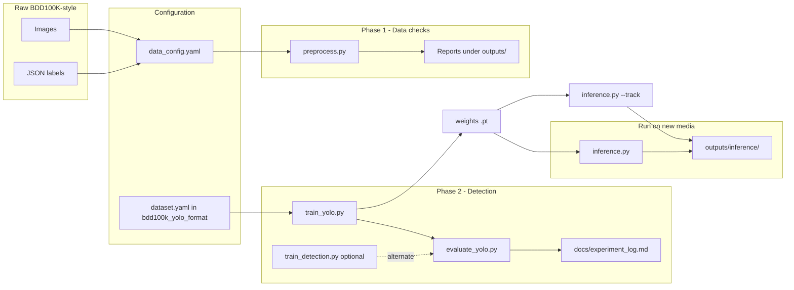

# Project context: how the pipeline fits together

This document is for anyone opening the repo who wants the **story** of what runs where—not a full command list (use [QUICKSTART.md](QUICKSTART.md) for copy-paste steps).

---

## End goal (vision)

The long-term idea is a **traffic monitoring stack**: detect objects → (later) segment lanes/road → (later) track identities across frames → optionally optimize and deploy.

**Today**, the code path that is fully wired is **object detection** on BDD100K-style data, using **Ultralytics YOLO**, plus **evaluation** and **inference** on images or video. Segmentation training, a combined det+seg+track pipeline, and deployment APIs are still **planned** (see [PROJECT_ROADMAP.md](PROJECT_ROADMAP.md)).

---

## Two data representations (why there are two paths)

BDD100K ships (or you organize) raw assets in a layout driven by **`configs/data_config.yaml`**:

- **Images** under something like `bdd100k_images_100k/100k/{train,val,test}/`
- **Detection labels** as **JSON** under a path such as `bdd100k_labels/100k/` (your `det_labels_dir` in config)

That layout feeds the **custom PyTorch dataset** code in `src/data/` (loaders, collate, augmentation). The **preprocess CLI** (`src/data/preprocess.py`) reads the same config to **validate** that this pipeline can load data, stress-test the **DataLoader**, and emit **quality reports**.

**Ultralytics** does not consume that JSON layout directly for training. It expects a **YOLO-style** tree: images + one `.txt` label file per image, plus a **`dataset.yaml`** that points at train/val/test folders. In this repo that export lives under **`bdd100k_yolo_format/`** (see `bdd100k_yolo_format/dataset.yaml`). Preparation and repair scripts live under **`src/data/`** (for example `prepare_dataset.py`, `fix_yolo_*`).

So in practice:

| Purpose | Data source | Typical entrypoints |
|--------|-------------|---------------------|
| Validate / explore PyTorch loading | JSON + images via `data_config.yaml` | `preprocess.py` |
| Train & val with Ultralytics | `bdd100k_yolo_format/` + `dataset.yaml` | `train_yolo.py`, `evaluate_yolo.py` |

Both paths should describe the **same underlying dataset**; they are two **formats**, not two unrelated datasets.

---

## Logical flow (what happens in order)

**Tracking:** For **persistent IDs across frames**, use **`python src/inference.py ... --track`** on a **video**, **webcam**, or **folder of images** (ordered sequence). Plain `--source` without `--track` is per-frame detection only. Ultralytics runs **ByteTrack** by default (`--tracker` for `botsort.yaml` or a custom YAML).

**Suggested mental model:**

1. **Configure** paths in `configs/data_config.yaml` so they match your disk.
2. **Sanity-check** the PyTorch-side pipeline with `preprocess.py` (optional but good when paths or labels change).
3. **Ensure** `bdd100k_yolo_format/` and `dataset.yaml` are correct for Ultralytics (`train_yolo.py --test-only` is a quick check).
4. **Train** with `train_yolo.py` (primary) or `train_detection.py` (alternate YAML-driven entry).
5. **Measure** with `evaluate_yolo.py` and **record** numbers in `docs/experiment_log.md`.
6. **Run** the same (or another) `.pt` on arbitrary images or video with `src/inference.py`; artifacts go under `outputs/inference/` by default.

---

## Where outputs land

| Step | Typical location |
|------|------------------|
| Preprocess / quality | `outputs/` (e.g. reports, `data_report.json`) |
| Ultralytics training | `outputs/yolo_training/<run_name>/` (weights, plots, `results.csv`) |
| Structured validation metrics | Printed by `evaluate_yolo.py` + Ultralytics run folders |
| Experiment history (you fill in) | `docs/experiment_log.md` |
| Inference (annotated media) | `outputs/inference/<name>/` |

---

## What is not wired yet

- **Segmentation** training (Mask R-CNN / YOLO-seg) as a first-class script in this repo.
- **Custom / research trackers** beyond Ultralytics’ built-in ByteTrack and BoT-SORT, plus **MOT metrics** (MOTA, IDF1) on benchmark sequences.
- **One unified binary** that runs det+seg+track in a single command (today detection and tracking are available; segmentation is separate/planned).

When those exist, the flow will likely become: **video frames → detector → (optional) segmenter → tracker → annotated video / API**—built on the same configs and experiment logging habits.

### Before / after viewer (images)

**Implemented:** [`demo_before_after.py`](demo_before_after.py) — one OpenCV window, **Space** toggles raw vs YOLO overlay, **Left/Right arrow** for previous/next image (**Q** / **Esc** quits). Requires **`opencv-python`** with HighGUI (if you only have **`opencv-python-headless`**, windows will fail—install full `opencv-python`, or use **`--save-dir`** to export before/after/pair JPEGs with no display).

**Implemented (upload UI):** [`app_upload_before_after.py`](app_upload_before_after.py) — local Gradio app where users upload image/video and get before/after outputs (with optional tracking on video). Install with `pip install -r requirements-webui.txt`.

**Still optional / future:** side-by-side layout, richer video review controls, or a production web backend—see Phase 4 visualization in [PROJECT_ROADMAP.md](PROJECT_ROADMAP.md).

---

## Related reading

- [README.md](README.md) — scope, install, command index  
- [QUICKSTART.md](QUICKSTART.md) — ordered commands  
- [PROJECT_ROADMAP.md](PROJECT_ROADMAP.md) — phased plan and checklists  
- [docs/experiment_log.md](docs/experiment_log.md) — where to pin metrics to real runs  
- [comprehensive_cv_project.md](comprehensive_cv_project.md) — proposal / narrative for portfolios (includes honest “repo vs vision” notes)
